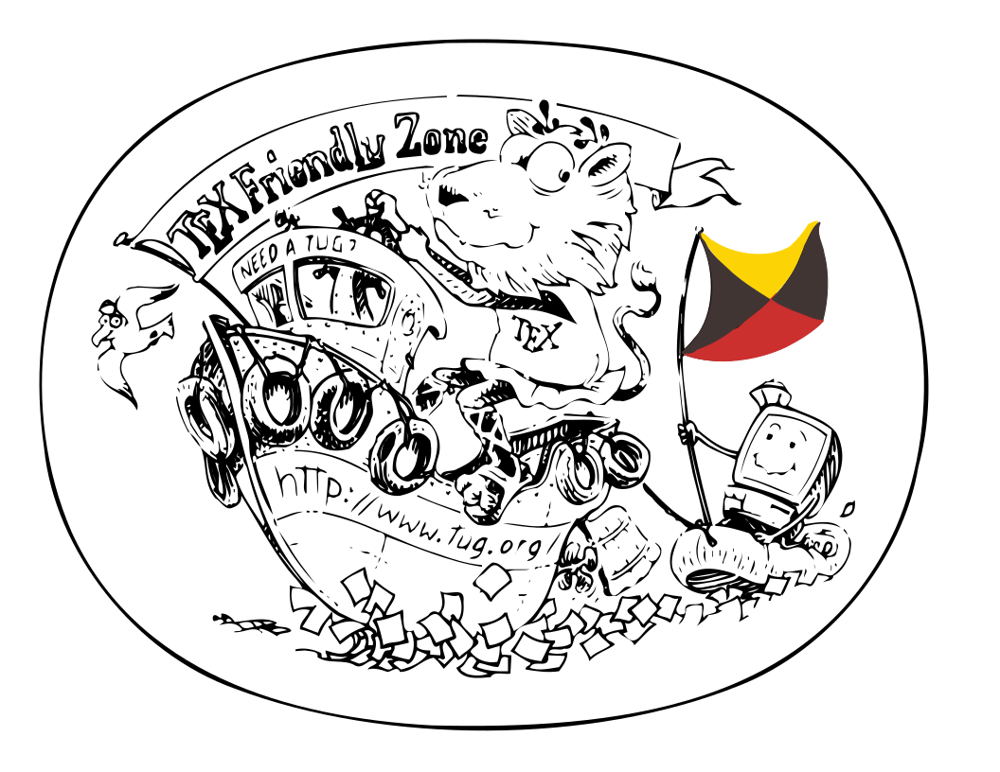

# Introduction

## Guide rapide

### Un exemple

- Cette présentation est produite à partir de `modele-presentation.md`
- Elle est conçue pour des présentations simples

### Un modèle

- Elle peut constituer un *modèle* pour faire d'autre présentations :
    1. créer un nouveau dossier
    2. y copier, renommer puis modifier le fichier `modele-diaporama.md`
    3. créer la présentation via la commande

        ```console
        md2pdf nom-du-fichier.md
        ```


# Faire une présentation avec `md2beamer`

## Introduction

- [Markdown](https://daringfireball.net/projects/markdown) est un langage de **balisage** *simple*
    - facile à lire et écrire par les humains et les programmes
    - qui permet de transformer un fichier balisé vers HTML ou PDF *automatiquement*
    - dont il existe plusieurs [variantes](https://flavoredmarkdown.com/)
    
- [Pandoc](https://pandoc.org) est un logiciel de conversion de documents
    - il permet de convertir des fichiers d'un format de balisage à un autre

- [LaTeX](https://www.latex-project.org) est un outil de composition de texte

- [Beamer](https://github.com/josephwright/beamer) est un paquet LaTeX pour préparer des présentations

- **`md2pdf`** est un simple script shell qui *enveloppe* un appel à `pandoc`
    - permet la conversion d'un fichier Markdown en PDF 
    - paramètre `pandoc` pour personnaliser la conversion

## Utiliser `md2pdf` pour faire une présentation

- Conseils
    1. construire la structure (plan) de la présentation en premier
    2. remplir le contenu ensuite sans trop surcharger le texte
    3. ne pas s'occuper de la mise en forme (`md2pdf` s'en occupe) 
    4. avoir un peu de discipline
        - être attentif aux indentations des lignes
        - espacer les sections de diapositives 
        - préférer les images vectorielles (SVG) aux matricielles
        - préférer le format PNG pour les images matricielles 

. . .

- Avantages
    - construction **très rapide** de présentation propre
    - style (*forme*) déporté vers le thème
    - rapide à prendre en main
    - sources réutilisables ailleurs

- Inconvénients
    - pas de constructions complexes (solution : LaTeX/Beamer directement)
    - pas d'utilisation simple de caractères unicode exotique 
    - difficile à débugger sans maîtriser la chaîne `pandoc`--`pdflatex`
        - passer par LaTeX via `-L` peut aider


# Une courte référence

## Markdown

La syntaxe de Markdown permet 

- de donner une **structure** au document
    - **paragraphes** : séparation par des lignes vides
    - **titres de différents niveaux** : lignes débutant par des `#`
    - **listes libres** : indentation de paragraphe avec lignes débutant par des `-` ou des `*`
    - **listes ordonnées** : indentation avec lignes débutant par des `1.`
    - **blocs de citations** : paragraphes préfixés par "`> `"
    - **blocs de codes** : paragraphes indentés par 4 espaces ou encadrés par \`\`\`

- d'inclure des éléments de mise en forme logique 

    *emphase*, **accentuation forte** et `code`

- d'inclure des liens vers des URL
    - <https://daringfireball.net/projects/markdown>
    - [Pandoc Markdown](https://pandoc.org/MANUAL.html#pandocs-markdown)
    - [CommonMark](https://commonmark.org)
    - [Markdown à la sauce GitLab](https://gitlab.com/help/user/markdown.md)
    - [Markdown à la sauce Github](https://guides.github.com/features/mastering-markdown)

    
Elle est décrite en détails ailleurs (cf liens de cette diapo)

## Images

- format Markdown :

    `{ width=30% .center }\ `

    { width=30% .center }\ 
    
    La séquence `\ ` en fin de ligne est utilisée pour éviter le traitement en figure

- permet de spécifier une largeur ou une hauteur
    - relative à la largeur de la diapo
- conversion automatique des références `.svg` en `.pdf` (qui doivent exister)
- centrage horizontal des images si elles ont la classe `.center`

## {.plain}

{ .center }\ 

Une diapo nommé `{.plain}` n'a ni titre, ni pied de page

## Tableaux

- Plusieurs types de support des tableaux
    - exemple avec le mode `pipe_tables` de `pandoc`
    
| **Outil**  | **Utilité**                                                 |
|------------|-------------------------------------------------------------|
| `pandoc`   | conversion de formats                                       |
| `pdflatex` | composition de LaTeX en PDF                                 |
| `beamer`   | jeux de balisage LaTeX pour la composition de présentation  |

- [pandoc#tables](https://pandoc.org/MANUAL.html#tables) liste les
  autres manières de saisir des tableaux

## Code source

Le code source peut être coloré en fonction de la syntaxe du language

```c
#include <stdio.h>
int main(int argc, char ** argv) {
    printf("Hello world !\n");
}
```

Il peut être inclus depuis un fichier
([filtre `include-code-files`](https://github.com/pandoc/lua-filters/tree/master/include-code-files))

``` {include="code-bash" .bash .numberLines}
```

## Spécificité des présentations

**Affichage incrémental**

> - affichage incrémental
> 
>     - pause via un paragraphe avec une ligne de trois points
>
>             . . .
>
>     - des items de listes dans des blocs de citations
>
>             > -
> 
> - ne pas trop en abuser !

. . .

**Listes**

- imbrication de listes limitée à une profondeur de 3

## Réglages `pandoc` utilisés par `md2pdf`

- les réglages sont visibles dans `makefile-pandoc`

- les diapositives sont les élements de niveau 2
    - niveaux supérieurs sont les sections du diaporama
    - niveaux inférieurs sont des blocs 
    - modifiable via la variable d'environnement `SLIDELEVEL`

- transformation avec un [*template*](https://pandoc.org/MANUAL.html#templates) ad-hoc
    - variables pour la page de titre
    - fixables dans un bloc [YAML](http://yaml.org/) (en début de fichier)

- variables prises en charge
    - `title`, `subtitle`, `author`, `date`
    - `titlegraphic` : images (type logos) sur la page de titre 
        - `file` : fichier sans extension
        - `width` : largeur en pourcentage (<1) de largeur diapo (0.1 par défaut)
        - `nl` : passage à la ligne après le logo
    - `titlebackground` : image de fond de la page de titre (fichier sans extension)

## Documentation 

- `md2pdf`
    - plusieurs thèmes inclus 
        - choix du thème via l'option `-t` ou la variable d'environnement `$THEME`
        - par défaut thème `ulille`
- documentation
    - intégrée

        ```console
        md2pdf -h
        md2pdf --man
        ```

    - lire la section [*Structuring the slide show*](http://pandoc.org/MANUAL.html#structuring-the-slide-show) de `pandoc(1)` aide aussi
